# Growtron

Grow automatizado para suas plantas
https://www.instagram.com/growtron.ino/

### Funcionalidades:
* Liga e desliga as luzes do grow nos horários configurados no Blink App
* Reconecta e sincroniza o estado dos rélés em caso de queda de luz
* Monitora a temperatura e umidade ambiente
* Monitora a umidade do solo
* Exibe as informações localmente no OLED
* Mede a luminosidade emitida pelas luzes do grow em Lux
* Timelapse configuravel com a ESP32-CAM

### Componentes necessários para executar o projeto:
* ESP32 30 pinos
* Modulo Rélé 
* Sensor de Temperatura e Umidade DHT22 ou DHT11
* Blynk app
* Arduino IDE

### Componentes opcionais:
* Sensor capacitivo de umidade do solo
* Sensor de luminosidade GY30
* Display OLED 0.91"
* ESP32-CAM

## Instalando a placa ESP32 no Arduino IDE

* Inicie o Arduino IDE e abra a janela de Preferências
* Inclua em "URLs Adicionais para Genrenciadores de Placas" o url da ESP32 https://raw.githubusercontent.com/espressif/arduino-esp32/gh-pages/package_esp32_index.json 
* Abra o Gerenciador de Placas em Ferramentas > Placa
* Procure por esp32 by Espressif Systems e instale
* Selecione sua a esp32 em Ferramentas > Placa > ESP32 Arduino > ESP32 Dev Module

## Instalando as bibliotecas necessárias

Abra o gerenciador de bibliotecas em Ferramentas > Gerenciador de Biliotecas...
E instale as seguintes bibliotecas:

* "Blynk by Volodymyr Shymanskyy"
* "DHT sensor library by Adafruit" e instale as bibliotecas extras necessárias
* "Time by Michael Margolis"
* "Time Alarms by Michael Margolis"
* "Adafruit GFX Library by Adafruit" e instale as bibliotecas extras necessárias
* "Adafruit SSD1306 by Adafruit"

## Configurando o Blynk

Baixe o aplicativo Blynk no seu smartphone
https://play.google.com/store/apps/details?id=cc.blynk&hl=pt_BR&gl=US

Utilize esse código como ponto de partida, preencha os dados da sua rede WIFI em "ssid" e senha em "pass" https://github.com/growtronino/growtron/tree/master/tutorial_growtron/blynk_dht

Crie um novo projeto no Blynk e siga os passos a seguir. Um token será gerado e enviado ao seu email, você deve inseri-lo na variavel "auth":

  
  
  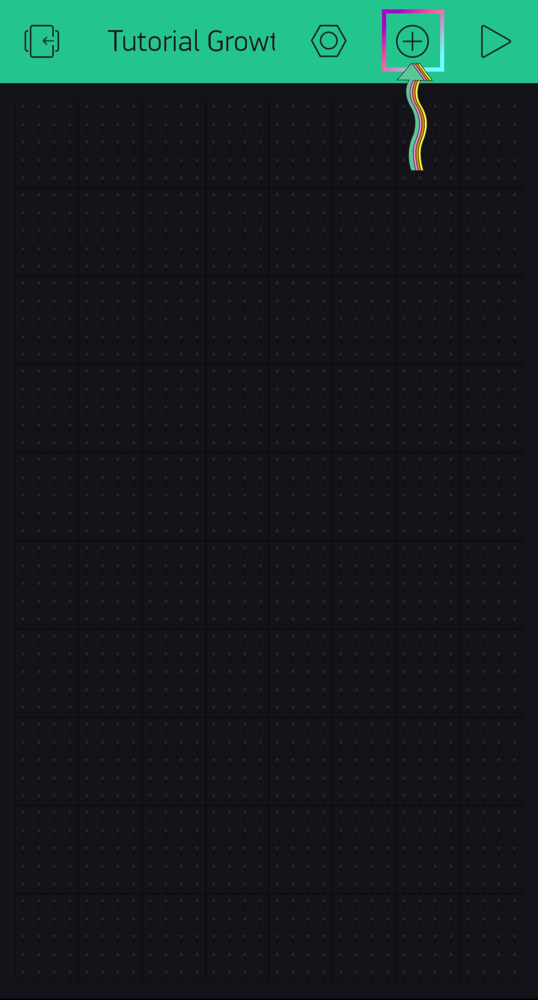

Adicione dois widgets labeled value para monitorar a temperatura e a umidade ambientes. Os widgets custam energias, você começa com 2000 energias, o que já é suficiente para executar o tutorial:

  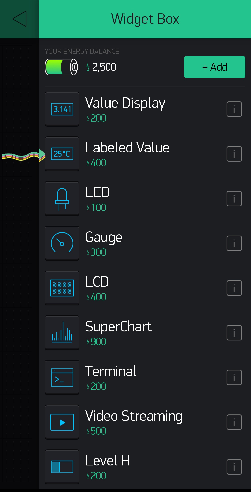
  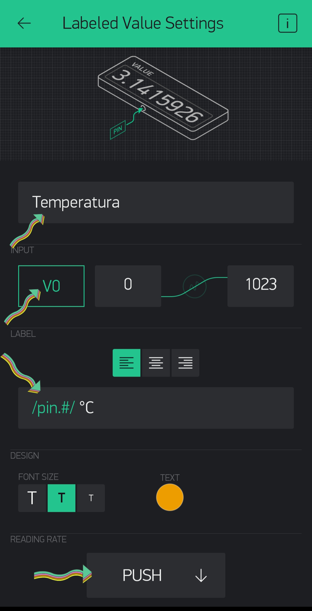
  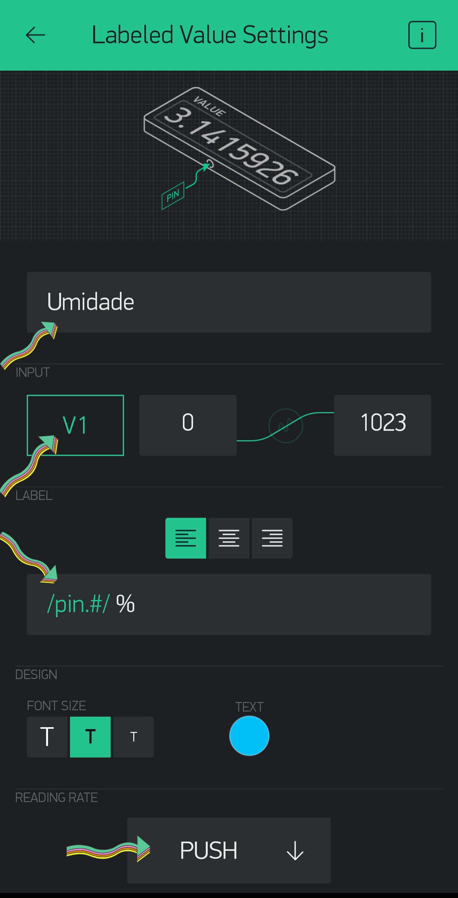

Adicione o widget Real Time Clock e de Play:

  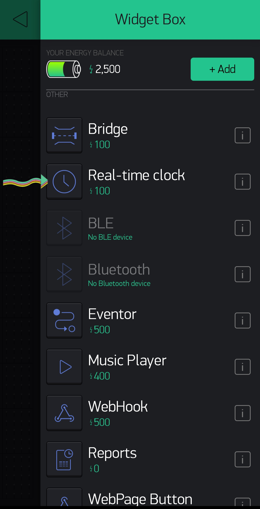
  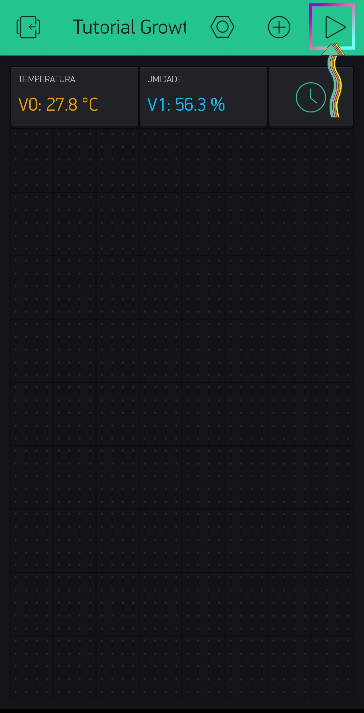
  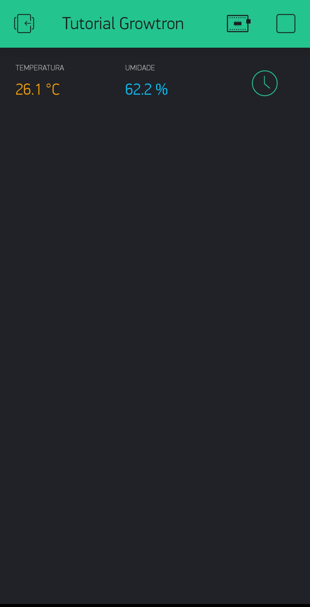

Agora você tem o monitoramento em tempo real da umidade e temperatura ambiente do seu Grow. O próximo passo é conectar o relé ao ESP32 e inserir o widget de Time Input no Blynk, que irá ser a entrada do usuário para inserir o fotoperíodo do Grow.

Utilize este código como ponto de partida para continuar o tutorial, preencha os dados da sua rede WIFI em "ssid", senha em "pass" e o token do blynk em "auth". 
https://github.com/growtronino/growtron/tree/master/tutorial_growtron/blynk_dht

  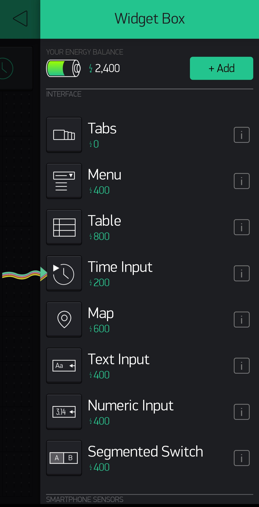
  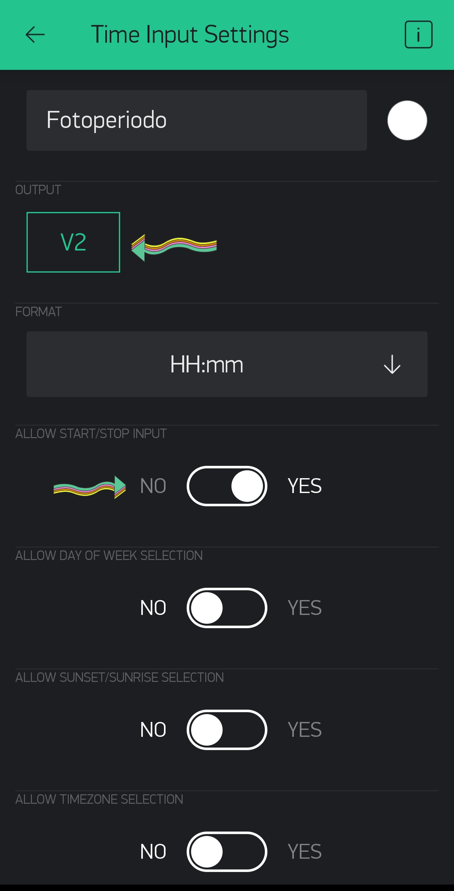
  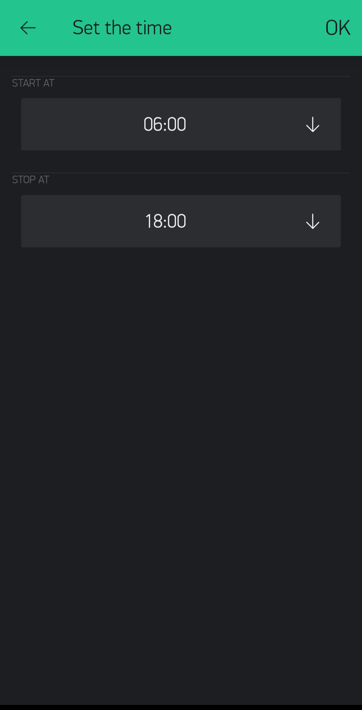

## Fazendo as conexões 

Siga o diagrama para conectar o sensor de umidade e temperatura DHT e o relé a ESP32:

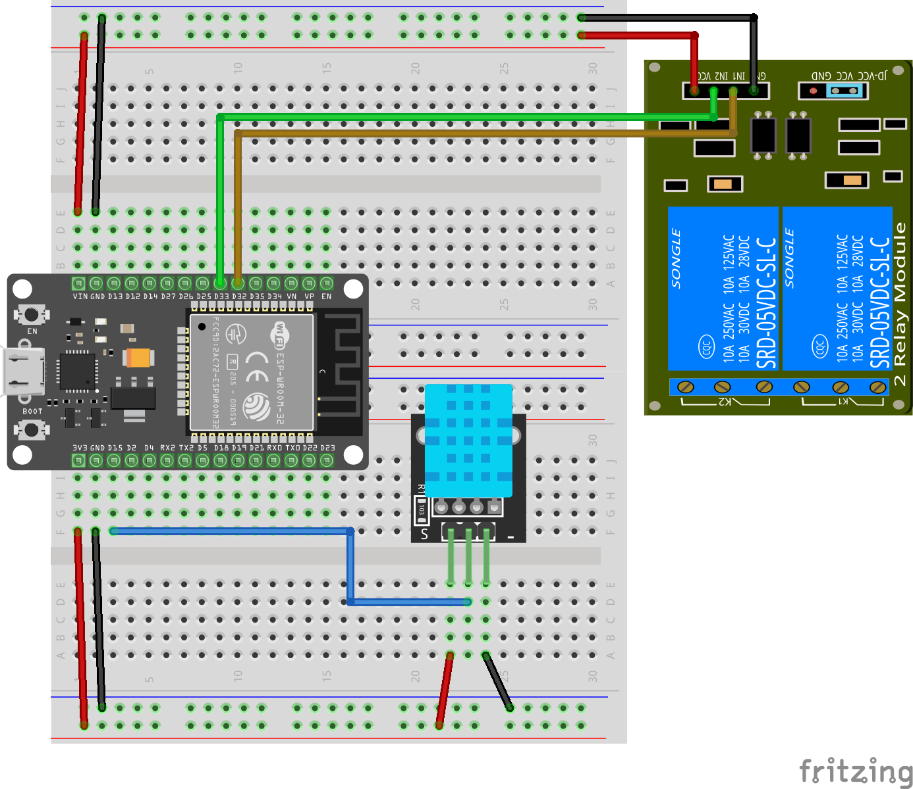

Siga o diagrama para conectar o OLED a ESP32:

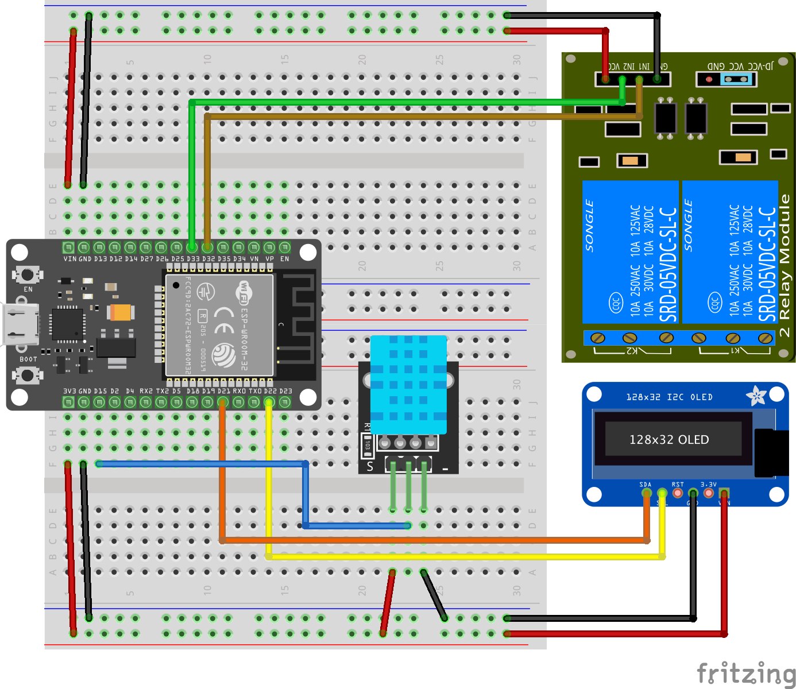

Siga o diagrama para conectar o sensor de umidade do solo a ESP32:

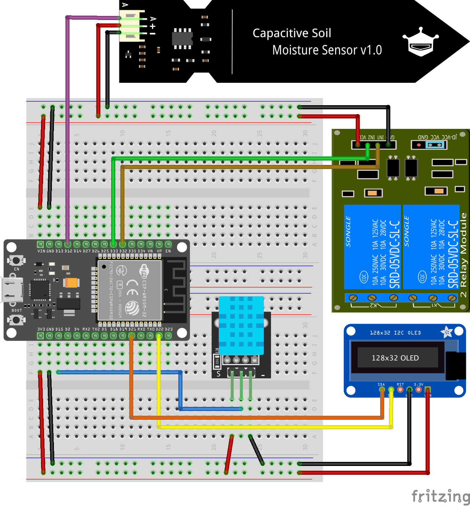
